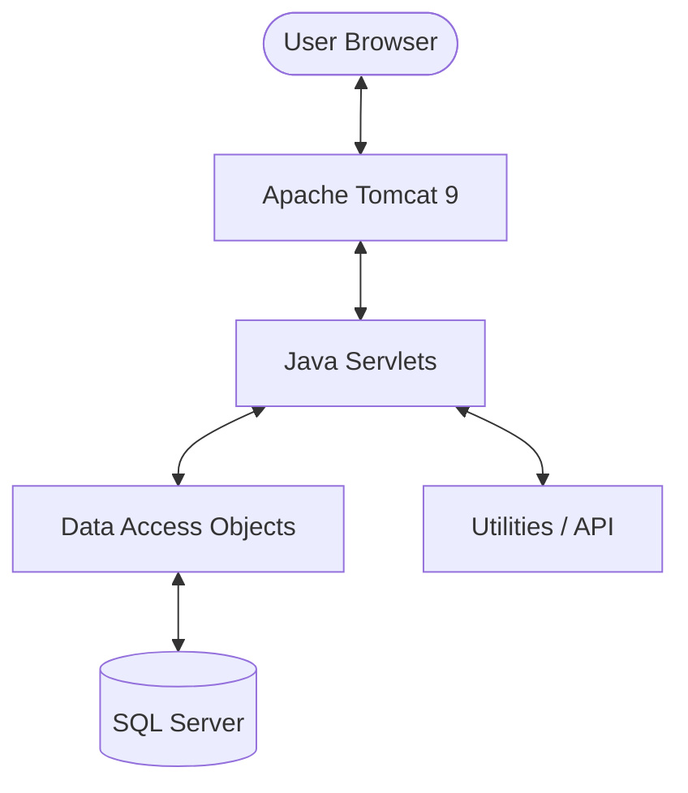

# Technical Architecture Guide — HiperInventory Solutions

This document provides a technical overview of the system architecture, build process, and data model.

## 🏗 System Components

The application follows a classic 3-tier architecture:

1.  **Presentation Tier**: JSP pages served by Tomcat.
2.  **Logic Tier**: Java Servlets handling business logic and request routing.
3.  **Data Tier**: Data Access Objects (DAO) communicating with Microsoft SQL Server.

## 🛠 Build System

We use **Apache Ant** for compilation and packaging. Due to the project's origins in NetBeans, we have implemented a specialized build process for CI/CD and Docker environments.

*   **`build-docker.xml`**: A streamlined Ant script created to avoid dependencies on the NetBeans IDE. It:
    1.  Sets up the build environment.
    2.  Compiles source code using the Tomcat J2EE classpath.
    3.  Packages the application as `ROOT.war` for deployment.

## 🐳 Containerization Strategy

The project uses a **multi-stage Docker build** to ensure a small, secure, and reproducible production image.

*   **Stage 1 (Builder)**: Uses `eclipse-temurin:11-jdk` to compile the application and download required libraries.
*   **Stage 2 (Runtime)**: Uses a clean `eclipse-temurin:11-jdk` image, installs Apache Tomcat 9 manually, and copies only the final `ROOT.war` and configuration files.

> [!NOTE]
> We chose `eclipse-temurin` because it is the official, community-supported replacement for the deprecated `openjdk` images.

## 📊 Data Model

The application manages assets through several interconnected entities:

*   **Asset**: The core entity (Computers, Furniture, etc.).
*   **User**: Management of administrative and regular users.
*   **Maintenance**: Logs of repairs and upkeep.
*   **Depreciation**: Calculated financial value of assets over time.
*   **AuditLog**: Immutable records of system changes.

## 🔒 Security

*   **AuthServlet**: Handles session-based authentication.
*   **OTP**: Provides a second layer of security for critical actions.
*   **ApiKeys**: Used for authenticating external API requests.
